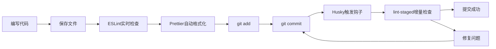

# 前端代码规范利器：ESLint + Prettier + Husky + lint-staged 实战指南

在现代前端开发中，代码质量和一致性是项目成功的关键因素。特别是在团队协作的大型项目中，统一的代码规范不仅能提升代码可读性，还能减少 bug 的产生，提高开发效率。本文将基于我参与开发的 **React 问卷编辑管理低代码平台** 项目经验，介绍如何使用 ESLint、Prettier、Husky 和 lint-staged 这四个工具来构建完善的前端代码规范体系。

## 项目背景

在开发低代码问卷编辑管理平台的过程中，我们面临着典型的团队协作挑战：

- **技术栈复杂**：React + Redux + Ant Design + Next.js + Koa2.js
- **功能模块多样**：问卷编辑器、管理后台、统计分析、C 端渲染页面
- **团队成员编码风格不一**：缩进、引号、换行等细节差异明显
- **代码质量参差不齐**：语法错误、潜在 bug 时有发生

为了解决这些问题，我们引入了一套完整的代码规范工具链，效果显著。

## 为什么需要代码规范工具？

### 现实痛点

在引入规范工具之前，我们的项目存在这些问题：

1. **代码审查效率低**：大量时间浪费在讨论代码格式问题上
2. **合并冲突频繁**：不同的格式化设置导致无意义的代码差异
3. **潜在 bug 难以发现**：没有统一的代码检查标准
4. **新人上手困难**：缺乏明确的编码规范参考

### 规范工具的价值

通过合理配置代码规范工具，我们实现了：

- 📏 **统一的代码风格**：所有代码看起来就像一个人写的
- 🔍 **自动化错误检测**：提前发现潜在问题
- ⚡ **提升开发效率**：减少手动格式化时间
- 🚪 **降低准入门槛**：新成员快速适应项目规范

## 四大工具解析

### 1. ESLint：代码质量的守护神

**ESLint** 是一个用于识别和报告 JavaScript 代码问题的静态分析工具。

#### 在问卷平台中的应用

在我们的 React 项目中，ESLint 主要解决了这些问题：

```javascript
// ❌ ESLint 会检测到的问题
function QuestionEditor() {
  const [questions, setQuestions] = useState([]); // 缺少分号

  useEffect(() => {
    fetchQuestions(); // 缺少依赖项检查
  }, []);

  // 未使用的变量
  const unusedVariable = "test";

  return (
    <div>
      {questions.map((q) => (
        <div>{q.title}</div>
      ))}{" "}
      {/* 缺少 key */}
    </div>
  );
}
```

```javascript
// ✅ 修复后的代码
function QuestionEditor() {
  const [questions, setQuestions] = useState([]);

  const fetchQuestions = useCallback(async () => {
    // 获取问卷数据
  }, []);

  useEffect(() => {
    fetchQuestions();
  }, [fetchQuestions]);

  return (
    <div>
      {questions.map((q) => (
        <div key={q.id}>{q.title}</div>
      ))}
    </div>
  );
}
```

#### 主要收益

- **React 相关检查**：检测 Hooks 使用规范、组件命名等
- **语法错误预防**：提前发现潜在的 JavaScript 错误
- **最佳实践强制**：确保团队遵循 React 开发最佳实践

### 2. Prettier：代码美化的艺术家

**Prettier** 是一个固执己见的代码格式化工具，专注于代码的视觉呈现。

#### 在问卷平台中的效果

在开发问卷编辑器组件时，Prettier 让我们的代码风格保持高度一致：

```javascript
// 格式化前（不同开发者的编码习惯）
const QuestionTypes = {
  SINGLE_CHOICE: "single_choice",
  MULTIPLE_CHOICE: "multiple_choice",
  TEXT_INPUT: "text_input",
};

function renderQuestion(question, index) {
  if (question.type === QuestionTypes.SINGLE_CHOICE) {
    return <RadioGroup options={question.options} />;
  } else if (question.type === QuestionTypes.MULTIPLE_CHOICE) {
    return <CheckboxGroup options={question.options} />;
  }
  return <TextInput placeholder={question.placeholder} />;
}
```

```javascript
// 格式化后（Prettier 统一处理）
const QuestionTypes = {
  SINGLE_CHOICE: "single_choice",
  MULTIPLE_CHOICE: "multiple_choice",
  TEXT_INPUT: "text_input",
};

function renderQuestion(question, index) {
  if (question.type === QuestionTypes.SINGLE_CHOICE) {
    return <RadioGroup options={question.options} />;
  } else if (question.type === QuestionTypes.MULTIPLE_CHOICE) {
    return <CheckboxGroup options={question.options} />;
  }
  return <TextInput placeholder={question.placeholder} />;
}
```

#### 配置要点

在项目中，我们使用了这样的 Prettier 配置：

```json
{
  "semi": true,
  "trailingComma": "es5",
  "singleQuote": true,
  "printWidth": 80,
  "tabWidth": 2,
  "useTabs": false
}
```

### 3. Husky：Git 钩子的管家

**Husky** 让我们能够轻松地在 Git 钩子中运行脚本，确保代码在提交前通过检查。

#### 在问卷平台中的守护作用

```json
// package.json 中的配置
{
  "husky": {
    "hooks": {
      "pre-commit": "lint-staged",
      "commit-msg": "commitlint -E HUSKY_GIT_PARAMS"
    }
  }
}
```

**实际使用场景**：

当团队成员提交包含问卷编辑器新功能的代码时：

```bash
$ git commit -m "feat: 添加单选题编辑功能"

# Husky 自动触发
✓ Running tasks for *.{js,jsx,ts,tsx}
✓ Running tasks for *.{css,scss,less}
✓ Checking commit message format

[main 1a2b3c4] feat: 添加单选题编辑功能
 3 files changed, 127 insertions(+), 12 deletions(-)
```

#### 价值体现

- **质量门槛**：确保不合规代码无法进入仓库
- **自动化执行**：无需手动运行检查命令
- **团队约束**：统一的代码提交标准

### 4. lint-staged：增量检查的智者

**lint-staged** 只对暂存区的文件运行检查，避免了全量检查的性能问题。

#### 在问卷平台中的高效应用

```json
// package.json 中的配置
{
  "lint-staged": {
    "*.{js,jsx,ts,tsx}": ["eslint --fix", "prettier --write"],
    "*.{css,scss,less}": ["stylelint --fix", "prettier --write"],
    "*.{json,md}": ["prettier --write"]
  }
}
```

**工作流程示例**：

1. 开发者修改了问卷统计页面的 `StatisticsChart.jsx`
2. 执行 `git add .`
3. 执行 `git commit`
4. lint-staged 只检查 `StatisticsChart.jsx`，而不是整个项目

#### 性能优势

在我们的项目中，全量检查需要 **45 秒**，而增量检查只需要 **3-8 秒**，大大提升了开发体验。

## 工具协作：1+1+1+1 > 4

### 完整的工作流

在低代码问卷平台开发中，这四个工具形成了完美的协作关系：



### 实际案例：添加问卷模板功能

让我们看一个具体的开发场景：

**步骤 1：编写代码**

```javascript
// components/TemplateSelector.jsx
import React, { useState, useEffect } from "react";
import { Card, Button, Modal } from "antd";

function TemplateSelector({ onSelect }) {
  const [templates, setTemplates] = useState([]);
  const [visible, setVisible] = useState(false);

  // 获取模板列表
  useEffect(() => {
    fetchTemplates().then(setTemplates);
  }, []);

  return (
    <div className="template-selector">
      {templates.map((template) => (
        <Card key={template.id} onClick={() => onSelect(template)}>
          <h3>{template.name}</h3>
          <p>{template.description}</p>
        </Card>
      ))}
    </div>
  );
}
```

**步骤 2：保存时自动处理**

- ESLint 检查：发现缺少 `fetchTemplates` 的依赖检查
- Prettier 格式化：调整代码风格

**步骤 3：提交前最终检查**

```bash
$ git add .
$ git commit -m "feat: 添加问卷模板选择器组件"

# lint-staged 运行
✓ ESLint 检查通过
✓ Prettier 格式化完成
✓ 所有检查通过，提交成功
```

## 实施建议与最佳实践

### 1. 渐进式引入策略

基于项目经验，建议按以下顺序引入：

1. **第一阶段**：Prettier（快速统一代码风格）
2. **第二阶段**：ESLint（逐步提升代码质量）
3. **第三阶段**：Husky + lint-staged（自动化流程）

### 2. 配置文件建议

**ESLint 配置（.eslintrc.js）**：

```javascript
module.exports = {
  extends: ["react-app", "react-app/jest", "@typescript-eslint/recommended"],
  rules: {
    "react-hooks/exhaustive-deps": "warn",
    "no-unused-vars": "error",
    "prefer-const": "error",
  },
};
```

**Prettier 配置（.prettierrc）**：

```json
{
  "semi": true,
  "trailingComma": "es5",
  "singleQuote": true,
  "printWidth": 80,
  "tabWidth": 2
}
```

### 3. 团队规范制定

- **统一 IDE 配置**：确保所有成员使用相同的编辑器设置
- **规范文档化**：将配置规则和原因记录在案
- **定期回顾**：根据项目发展调整规范标准

## 收益总结

在低代码问卷平台项目中，引入这套代码规范体系后，我们获得了显著的收益：

### 定量收益

- **代码审查时间减少 60%**：格式问题自动解决
- **bug 率降低 35%**：ESLint 提前发现潜在问题
- **新人适应时间缩短 50%**：统一的代码风格易于理解

### 定性收益

- **团队协作更和谐**：减少了格式争议
- **代码质量更稳定**：统一的质量标准
- **开发体验更流畅**：自动化工具减少重复工作

## 总结

ESLint、Prettier、Husky 和 lint-staged 这四个工具在前端代码规范中各司其职，又相互配合：

- **ESLint** 保证代码质量和逻辑正确性
- **Prettier** 确保代码格式的一致性和美观性
- **Husky** 提供自动化的质量门槛
- **lint-staged** 优化检查性能，提升开发体验

在团队项目中，特别是像低代码问卷平台这样的复杂应用，这套工具组合不仅能提升代码质量，更能改善团队协作效率。建议每个前端团队都应该根据项目特点，建立适合自己的代码规范体系。

---

_本文基于真实项目经验总结，希望能为你的前端代码规范建设提供参考价值。_
